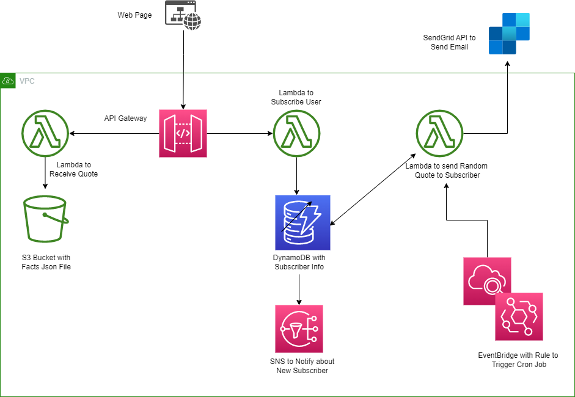

# aws-email-sub-service
Email Subscription Service using various AWS services

## Overview
This application allows users to sign up via a webpage to receive daily
random facts. Sending of the random fact is scheduled via a cron job.

## Diagram

* The JSON file is located in an S3 Buket
* A lambda can make a GET request to receive the JSON with all quotes via the API Gateway
* A subscriber is added to the db when they add their email via the web page. This subscription is done via the addSubscriber Lambda
* SNS is used to notify that a new user has been subscribed. The Topic is specific to this app
*  A rule is created in eventbridge to set up a cron job to trigger the staticMailer lambda to get a list of all subscribers and the facts Json File. It chooses a random quote for the day.
* An email is sent to all subscribers using your SendGrid API Key with a random fact of the day. 

Set Sendrgid api key in PowerShell:
$env:SENDGRID_API_KEY = ""

